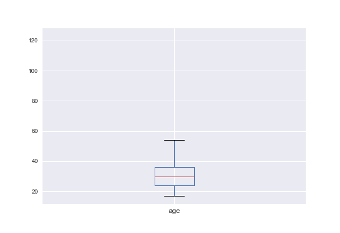
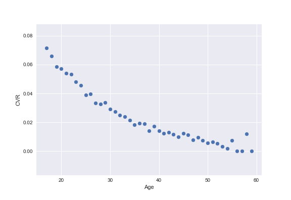
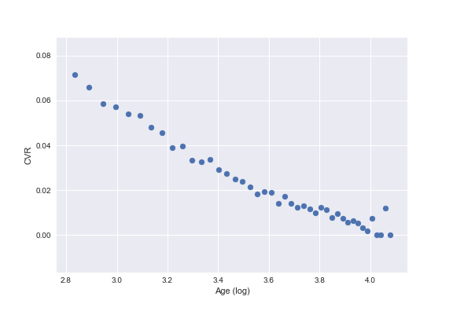
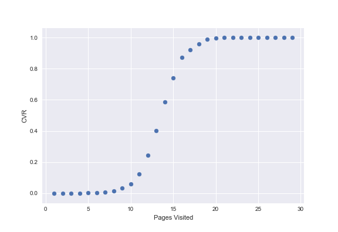
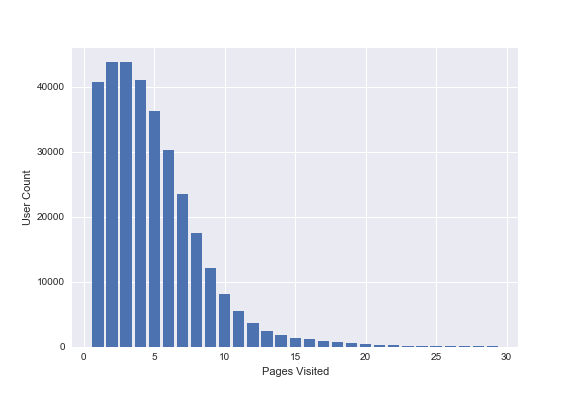
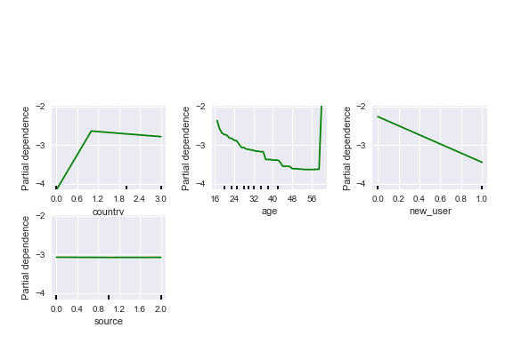

# Initial data validation

Let's took some preliminary look at the data. We have six columns: country, age, new_user, source, total_pages_visited, converted.

| no | country | age   | new_user | source | total_pages_visited | converted |   
|---------|-------|----------|--------|---------------------|-----------|---|
| 0       | UK    | 25       | 1      | Ads                 | 1         | 0 |
| 1       | US    | 23       | 1      | Seo                 | 5         | 0 |
| 2       | US    | 28       | 1      | Seo                 | 4         | 0 |
| 3       | China | 39       | 1      | Seo                 | 5         | 0 |
| 4       | US    | 30       | 1      | Seo                 | 6         | 0 |

We want to check if our data contain any missing or null values. It looks like that's not the case for this dataset.

```
<class 'pandas.core.frame.DataFrame'>
RangeIndex: 316200 entries, 0 to 316199
Data columns (total 6 columns):
country                316200 non-null object
age                    316200 non-null int64
new_user               316200 non-null int64
source                 316200 non-null object
total_pages_visited    316200 non-null int64
converted              316200 non-null int64
dtypes: int64(4), object(2)
memory usage: 14.5+ MB
```

```
country: array(['UK', 'US', 'China', 'Germany'], dtype=object)
age: array([ 25,  23,  28,  39,  30,  31,  27,  29,  38,  43,  24,  36,  37,
        33,  20,  35,  17,  50,  22,  18,  34,  19,  42,  32,  21,  48,
        40,  41,  26,  45,  44,  49,  46,  56,  52,  54,  51,  47,  53,
        60,  57,  55,  59,  61,  58,  62,  65,  63,  66,  67,  64,  68,
        69, 123,  70,  73,  77,  72,  79, 111])
source: array(['Ads', 'Seo', 'Direct'], dtype=object)
total_pages_visited: array([ 1,  5,  4,  6,  2,  8,  7,  3,  9, 14, 10, 11, 18, 15, 19, 12, 13,
       21, 17, 23, 16, 25, 26, 20, 22, 24, 27, 28, 29])
new_user: array([1, 0])
converted: array([0, 1])
```

Let's take a look at some summary statistics for our data. Two things jump out here:
1. Only 3% of the users converted, which is reasonable per industry standard, but that means that our data-set is very imbalanced.
2. The max value of age is 123, which seems unreasonable. We would need to zoom in on this later to potentially eliminate those outliers.

| stat | age   | new_user      | total_pages_visited | converted     |                
|-------|---------------|---------------------|---------------|---------------|
| count | 316200.000000 | 316200.000000       | 316200.000000 | 316200.000000 |
| mean  | 30.569858     | 0.685465            | 4.872966      | 0.032258      |
| std   | 8.271802      | 0.464331            | 3.341104      | 0.176685      |
| min   | 17.000000     | 0.000000            | 1.000000      | 0.000000      |
| 25%   | 24.000000     | 0.000000            | 2.000000      | 0.000000      |
| 50%   | 30.000000     | 1.000000            | 4.000000      | 0.000000      |
| 75%   | 36.000000     | 1.000000            | 7.000000      | 0.000000      |
| max   | 123.000000    | 1.000000            | 29.000000     | 1.000000      |

# Data cleaning

Our data-set is already pretty clean. However, we need to take a look at the age outliers.



It looks like most of our values lie between 17 and 60, with some extreme outliers.

Examine the list of values shows that we have 237 values above 60. This represents a very small percentage (.075%) of our data.

```
df[df.age > 60].shape (237, 6)
```

In an extremely unbalanced data-set, we should be weary of discarding even a small amount of data because that subset might contain valuable signal. For example, if all those 237 data points converted, indicating a strong relationship between age and conversion, we would be discarding valuable signal.

In this case, the conversion rate among those older than 60 is 1.26%, which is even less than the average. So we should be okay with discarding the data.

# Exploratory data analysis

Let's group the conversions by features and see if we can identify any pattern in our data.

## Country

| no. | country | total_pages_visited | converted | cnt  | user_cvr | page_cvr |          
|---------|---------------------|-----------|------|----------|----------|----------|
| 0       | China               | 348417    | 102  | 76519    | 0.001333 | 0.000293 |
| 1       | Germany             | 67688     | 815  | 13041    | 0.062495 | 0.012041 |
| 2       | UK                  | 246069    | 2549 | 48409    | 0.052655 | 0.010359 |
| 3       | US                  | 877150    | 6729 | 177900   | 0.037825 | 0.007671 |

Immediately we see that users from UK, US and Germany convert at a much higher rate than China.

## Age



There seems to be a relationship between age and CVR. If we take the log of the age values, we get a more linear pattern.



This tells us that younger people are much more likely to convert than older users.

## Source

| no. | source | total_pages_visited | converted | cnt  | user_cvr | page_cvr |          
|--------|---------------------|-----------|------|----------|----------|----------|
| 0      | Ads                 | 434331    | 3058 | 88642    | 0.034498 | 0.007041 |
| 1      | Direct              | 348462    | 2040 | 72342    | 0.028199 | 0.005854 |
| 2      | Seo                 | 756531    | 5097 | 154885   | 0.032908 | 0.006737 |

There does not seem to be much difference in conversion between users coming from Ads and SEO, though both convert better than direct traffic.

## Page



This is very much similar to the sigmoid shape that we look for in a classifier.  What this tells us that the number of pages visited will be a very strong indicator of conversion.

From this graph, any user who visits fewer than 8 pages will almost never convert, whereas any user who visits more than 18 pages will almost always convert.



A bar chart shows us the a large majority of our users visits fewer than 8 pages.

## New User

| no. | new_user | total_pages_visited | converted | cnt  | user_ctr | page_ctr |          
|----------|---------------------|-----------|------|----------|----------|----------|
| 0        | 0                   | 524580    | 7157 | 99346    | 0.072041 | 0.013643 |
| 1        | 1                   | 1014744   | 3038 | 216523   | 0.014031 | 0.002994 |

Existing users convert at almost 5 times the rate of new users, while the ratio of new to existing users is roughly 2:1.

# Modeling

## Model Selection

After doing some exploratory data analysis, we have some hypotheses for what factors impact conversion rate:

1. Number of pages visited is a significant predictor. Users who visit more than 18 pages tends to always convert while users who visit fewer than 8 pages tend to never convert.
2. Existing users tend to convert significantly more than new users.
3. Conversion rate goes down linearly with age (logged)
4. Ads and SEO tend to convert better than direct visits
5. Users from US, UK and Germany convert more than users from China.

Since we need to make some concrete recommendations, our model needs to have high interpretability as well as high predictive power. This limits us to a number of models where we can interpret feature importances. Some candidates are: logistics regression (LogR), random forest (RF), gradient boosting decision tree (GDBR). If there is more time, xgboost might also be considered.

We know that we have a very imbalanced data-set, and that a single feature - the number of pages visited - is a strong predictor. This tells us that a tree-based model would likely be the best performing candidate because:

- its hierarchical splitting nature will help pick up the dominant feature right away.
- the deeper interaction allows it to pick up signal for a small positive class.

 LogR is the most interpretable classifier but we might have to tradeoff predictive power for that interpretability.

For these reasons, we will fit both classifiers to see which perform best. RF generally works out of the box with fewer parameters needed to be tuned than GDBR, but unfortunately there is no built-in feature importance calculation for RF in sk-learn. Therefore, in the interest of time, we will go with the default GDBR for our tree-based model.

## Model and Date Parameters

We use a 70:30 stratified train-test set split.

For logistics regression, we use a pipeline to transform the data and dummify the categorical variables. We also fit an additional model with resampled data where the majority class is downsampled to create a 1:1 balanced dataset.

For GDBR, we use 100 trees.

## Evaluation Metrics

We use the Area Under ROC Curve (AUROC) as our evaluation metrics. For an imbalanced data set, we can achieve high accuracy by simply always predicting the majority class all of the times. That's why accuracy is generally not a good metrics for this use case. AUROC balances the true positives and false positives.

Depending on our particular requirements, we might also choose to penalize false negatives or use a cost-benefit matrix.

# Results

## Model

Logistics regression, even with resampling, does not perform well.

With resampling:
- train set: 0.5149
- test set: 0.5016

Without resampling
- train set: 0.5063
- test set: 0.4995

Both RF and GDBR perform much better. Here is the result for GDBR:
- train set: 0.9855
- test set: 0.9860

Considering the substantial difference in predictive power, we would go with a tree-based model in exchange for some loss in interpretability.

## Feature Importance
Using feature importances, we can see if our initial hypotheses about factors impacting conversion are correct. Since we already know the total number of pages visited is a strong predictor, we choose to look at the other four features.



Legend
- country: {0: China, 1: Germany, 2: UK, 3: US}
- new_user: {0: existing, 1: new}
- source: {0: ads, 1: direct, 2: seo}

The first three graphs confirm our hypotheses that
1. Chinese users convert much less
2. Conversion decreases with age
3. Existing users convert better

However, the source itself does not seem to impact conversion rate.

# Recommendations

Here are some concrete recommendations:

1. Incentivize page views: users who tend to convert of course spend more time on the site. The number of pages visited is just a proxy for the interest level. Forcing users to view more pages does not guarantee higher conversion and in the contrary, poor navigation might actually decrease CVR. We could consider more natural incentives by offering recommendations and browsing options like 'most popular', 'related items', etc because those tackle the underlying interest level.
2. Re-examine Chinese-version site: There might be something wrong with the Chinese site, perhaps poor localization, untrendy offerings, etc. We should take a deep dive into this.
3. Find way to convert new users to existing users: it makes sense that existing users convert better: they have been with the site for a certain amount of time. We should offer incentives for users to sign up for an account and continue to nurture / engagement them over time.
4. Target younger audience: seeing that conversion rate goes down non-linearly with age, we should re-allocate our marketing budget and branding to gear toward a younger crowd because our products clearly resonate with them.
5. Save paid marketing budget: since the different sources do not have any significant bearing on conversion rate, we should re-examine our paid ads / SEO strategies or divert money from this area altogether.
